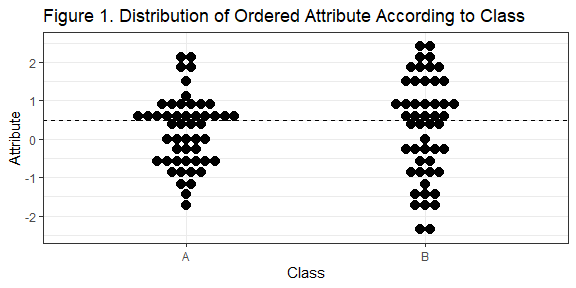

<!-- README.md is generated from README.Rmd. Please edit that file -->
ODA User Guide
==============

Created by: Nathaniel J. Rhodes, PharmD, MSc and Paul R. Yarnold, PhD

<!-- badges: start -->
[](https://zenodo.org/badge/latestdoi/301721752) <!-- badges: end -->

This package contains the functions needed to run and evaluate the output from MegaODA software. To fully utilize this interface, a valid licensed copy of MegaODA is required. For any statistical hypothesis, this non-parametric statistically-motivated machine-learning algorithm explicitly obtains the model which maximizes the (weighted) predictive accuracy for the sample. Many model validation methods are available. Users are encouraged to read about the ODA paradigm in Maximizing Predictive Accuracy (Paul Yarnold and Robert Soltysik, 2016), or on the ODA website. This package was developed by Nathaniel J. Rhodes to interface with ODA to assist the user in developing, evaluating, and validating maximum-accuracy ODA models.

Installation
------------

You can install ODA from [GitHub](https://github.com/njrhodes/ODA) with:

``` r
devtools::install_github("njrhodes/ODA",ref='main')
```

Warning: The full use of this package requires a valid licensed copy of the MegaODA suite. To obtain a valid licensed copy, the user is referred to the [ODA Journal](https://www.odajournal.com/).

Warning: MegaODA.exe is only supported on Intel Processors at this time.

What is Optimal Data Analysis (ODA)?
------------------------------------

*Optimal Discriminant Analysis*, also known as *Optimal Data Analysis*, is a non-parametric machine learning algorithm derived using operations research optimization methods almost forty years ago.[1] For more details on ODA and ODA applications, please visit <https://odajournal.com/>.

ODA Maximizes Classification Accuracy
-------------------------------------

Every statistical model developed using the ODA algorithm explicitly maximizes the classification accuracy which is achieved for the training sample.[2] “Optimal” means that an ODA model achieves the theoretically maximum possible level of accuracy in any given application: this is traditional nomenclature in operations research.[3]

What is Meant by Classification Accuracy in ODA?
------------------------------------------------

Consider a training sample with 100 observations of an Ordered Attribute which are either from Class A or Class B (**Figure 1**). Assume that this model identifies a cutpoint in the data when used for classification of the the Class variable (i.e., the "dependent variable") such that:

-   *If* Attribute &gt; 0.5, *then* predict Class A; *Otherwise*
-   *If* Attribute &lt;= 0.5, *then* predict Class B.

Using the Attribute (i.e., "independent variable") cutpoint, ODA classifies each observation in the sample into one of the two Class categories in this example. If the classified category and the actual category for an observation are the same, then a point is scored. If the classified category and the actual category differ, then no point is scored. If observations are weighted (e.g., by value or importance), then the optimal weighted solution may be identified.

The classification accuracy can then be calculated from the cross-class table (i.e., confusion matrix) of these predictions *vs*. the original observations as shown in **Table 1** below.

    #> Loading required package: ggplot2



    #> Table 1. Confusion Matrix for Class Observations (v1) vs.
    #>  Predicted Class using Attribute Cutpoint (x)
    #> [[1]]
    #>    x
    #> v1   0  1
    #>   A 27 23
    #>   B 25 25
    #> Percent Accuracy in Classification = 52
    #> Effect Strength for Sensitivity = 4

As illustrated above, there are two types of classification accuracy which may be optimized.

First, ODA can be used to optimize the overall Percentage Accuracy in Classification or PAC: that is, the largest number of (weighted) points which it is possible to obtain for the data in the application. This objective function, as it is called in operations research, does not distinguish between Class A and Class B observations—instead the only concern is maximizing the number of (weighted) points that are obtained.

Second, ODA can be used to optimize the Effect Strength for Sensitivity or ESS: that is, the largest average of (weighted) points which it is possible to obtain for the Class A and Class B observations in the sample. If the Attribute being used to make classifications between the two Classes is a random variable (as is the case in the **Table 1** above), then roughly half the Class A observations and half the Class B observations are expected to be correctly classified, and half of each Class are expected to be misclassified, simply by chance. Thus, unlike PAC, ESS is normed against chance.\[2\] Thus, ESS reflects the predictive capacity of a model above and beyond that which can be expected by random chance, serving as an intuitive re-expression of model accuracy.

What do Optimal and Suboptimal Mean in the ODA Paradigm?
--------------------------------------------------------

For every unique sample, variable geometry, and weighting scheme there exists an optimal solution. The optimal solution is the most accurate solution that is theoretically possible to obtain for the sample. If a statistical model explicitly obtains the most accurate possible solution for a given problem, then the model is said to be an optimal model—by definition. If a methodology explicitly obtains the most accurate possible solution for a given problem, then the methodology is said to be optimal—by definition. It is the meaning of the word in this context. Any method which fails to explicitly prove optimality is called suboptimal—by definition.

To be explicitly optimal, a method must be specifically formulated to find the most accurate solution. Obtaining an optimal model is an operations research problem. Every different sample is a separate, unique optimization problem. For every statistical application the name of the most accurate possible model is the optimal solution, and there's only one way to explicitly achieve the optimal solution—by using operations research methods, including specifically-engineered software like ODA.[4] Remarkably, it is possible to drape operations research methods in an exact statistical paradigm—the name of that paradigm is Optimal Data Analysis.\[3\]

How Does ODA Find an Optimal Solution?
--------------------------------------

In any given application ODA finds the cutpoint for an ordered attribute (independent variable), or the assignment rule for a categorical attribute, that most accurately (optimally) discriminates the two or more categories of the class (dependent) variable.[5] For example, imagine a hypothetical study involving a two-category class variable \[whether or not a patient has cardiovascular (CV) disease\]; an ordered attribute (systolic blood pressure, in mmHg); and a categorical attribute \[gender: male (M) or female (F)\]. Further imagine that the most accurate possible ODA model for predicting presence versus absence of disease for systolic blood pressure (SBP) is: if SBP&lt;145 mmHg, predict the patient has no disease; if SBP&gt;145 mmHg, predict the patient has disease. Finally imagine the most accurate ODA gender model for predicting presence versus absence of disease is: if gender=F, predict no disease; if gender=M, predict disease. The hypothetical data are summarized in **Figure 2**. The confusion matrix for the hypothetical model of disease predicted by SBP &gt;145 mmHg is shown in **Table 2**, and the confusion matrix for the hypothetical model of disease predicted by gender is shown in **Table 3**.


    #> Table 2. Confusion Matrix for SBP Model Observations (v1) vs. Predictions (x)
    #> [[1]]
    #>    x
    #> v1   0  1
    #>   0 19  6
    #>   1 11 14
    #> ESS = 100*(((56+76)/2)-50)/(100-50) = 32
    #> Table 3. Confusion Matrix for Gender Model Observations (v1) vs. Predictions (x)
    #> [[1]]
    #>    x
    #> v1   0  1
    #>   0 20  5
    #>   1  5 20
    #> ESS = 100*(((80+80)/2)-50)/(100-50) = 60

In this example the hypothetical ODA model classifiying disease which used SBP but ignored sex-based differences yielded an effect strength for sensitivity (ESS) of 32, a moderate effect.\[2\] On the other hand, the hypothetical ODA model that classified disease based on gender (M/F) *a priori* had an ESS of 60, a relatively strong effect.\[2\] The gender-based model yielded a nearly two-fold increase in predicitive accuracy *vs*. SBP alone. The difference between these models in predicitve capacity should prompt additional investigative aims and might lead an investigator to suspect that a failure to disaggregate SBP according to gender (M/F) has resulted in paradoxical confounding vis-a-vis Simpson's paradox.\[2,4\]

How is the most accurate possible model for a given attribute and sample identified?
------------------------------------------------------------------------------------

For any given application, identifying the most accurate cutpoint (or assignment rule) requires iterating through every possible value for an ordered attribute, or rule for a categorical attribute, and computing the percentage accurate classification (PAC), or the effect strength for sensitivity (ESS), which is obtained by using each cutpoint (or rule) to classify all of the sample observations.\[2\]

Computing the Overall PAC Measure of Classification Accuracy
------------------------------------------------------------

An index of model accuracy that does not adjust for the effect of chance, overall PAC is the total percent of (weighted) accurate classifications obtained for the total sample by using the cutpoint (or rule) to classify observations, with a minimum possible performance of 0% accurate (weighted) classifications, and maximum possible performance of 100% accurate (weighted) classifications. By definition, for any given application, the maximum accuracy optimal model uses the optimal cutpoint for ordered attributes—or the optimal assignment rule for categorical attributes—that yields the greatest overall PAC value. A maximum overall PAC model is identified by specifying `PRIORS OFF` within the MegaODA software.

For example, imagine an application with two class categories, and that class 0 and class 1 both have 50 observations (total sample size is 100 observations). If the optimal model classifies 30 of the class 0 observations, and 40 of the class 1 observations, then overall PAC = 100 x (30 + 40)/100 = 70. Or, imagine an application with three class categories: 100 class 0 observations, 60 class 1 observations, and 40 class 2 observations (total sample size is 200 observations). If the optimal model classifies 60 of the class 0 observations, 40 of the class 1 observations, and 30 of the class 2 observations, then overall PAC = 100 x (60 + 40 + 30)/200 = 65. No general convention has been specified to evaluate the strength-of-effect of ODA models which maximize overall PAC.

The optimal model is subjected to a non-parametric permutation test to assess statistical significance of obtained overall PAC.\[1\] [6] [7] Additionally, ODA model reproducibility and cross-generalizability are assessed using cross-validation methods such as leave-one-out (LOO), jackknife, K-unfolding, bootstrap, or hold-out analysis.\[2\][8]

Computing and Interpreting the ESS and D measures of Classification Accuracy
----------------------------------------------------------------------------

An index of model accuracy that does adjust for the effect of chance, ESS is the mean (weighted) sensitivity obtained across class categories by using the cutpoint (or rule) to classify observations, standardized using a 0%-100% scale on which 0% represents the level of classification accuracy expected by chance; 100% represents perfect accuracy; and negative ESS values indicate accuracy that is worse than is expected by chance. By definition, for every application, the maximum accuracy (optimal) model uses the cutpoint for ordered attributes—or the assignment rule for categorical attributes—yielding the greatest ESS value. A maximum ESS optimal model is identified by specifying `PRIORS ON` in the MegaODA software.

ESS is easily computed. For an application involving C class categories (the minimum number of class categories is two), compute C' = 100/C. For two class categories, C = 100/2 = 50, for three class categories, C = 100/3 = 33.3, etcetera. Also compute the mean PAC for the C categories. For two class categories, add the PAC for class 0 (called “specificity” in the field of epidemiology) and for class 1 (“sensitivity”), and divide the sum by 2. For three class categories sum PAC for classes 0, 1 and 2, and divide the sum by 3, and so forth. The formula to compute ESS for C' class categories is:

-   ESS = 100 x (PAC - C')/(100 - C')

For example, for an application with two class categories (C = 2) C' = 100/2 = 50, with a specificity of 65% and a sensitivity of 85%, therefore mean PAC = (65 + 85)/2 = 75%. ESS can then be calculated as:

-   ESS = 100 x (75 - 50)/(100 - 50) = 100 x 25/50 = 100 x 0.5 = 50

For an application with five class categories (C = 5), C' = 100/5 = 20, with a mean PAC across the five categories of 40%, thus the ESS can be calculated as:

-   ESS = 100 x (40 - 20)/(100 - 40) = 100 x 20/60 = 100 x 0.33 = 33.3

The mean PAC expected by chance is 100/C percent for an application with C class categories. For example, the mean PAC expected by chance is 50% for a two-category class variable, and 33.3% for a three-category class variable. The convention used to evaluate the strength-of-effect of ODA models which maximize ESS derives from simulation research: ESS&lt;25% is a relatively weak effect; &lt;50% is a moderate effect; &lt;75% is a relatively strong effect; &lt;90% is a strong effect; and &gt; 90% is a very strong effect.\[2\]

The optimal model is subjected to a non-parametric permutation test to assess statistical significance of obtained ESS.\[1,6,7\] Model reproducibility and cross-generalizability are assessed using cross-validation methods such as leave-one-out (LOO), jackknife, K-unfolding, bootstrap, or hold-out analysis.\[2\]

Whereas ESS corrects classification accuracy for chance, the D statistic corrects the ESS statistic for model complexity—defined as the number of model endpoints, which are also called strata.<sup>8,9</sup> If the model has two class categories, then there are two strata; a model with three class categories has three strata, and a model with C class categories has C strata. The D statistic indicates the “distance” of an optimal solution from a perfect model which attains 100% accuracy, and it is defined as:

-   D = 100/(ESS/Strata) - Strata

For example, for a model with two class categories and ESS of 50, D = 100/(50/2) - 2, or D = 100/25 - 2, and D = 4 - 2 = 2. This value of D indicates that two additional effects with the same mean ESS value obtained by the optimal model are required to achieve perfect classification (i.e., ESS = 100). For a model with three class categories and ESS of 40, D = 100/(40/3) - 3, or D = 100/13.33 - 3, and D = 7.5 - 3 = 4.5. This value of D indicates that 4.5 additional effects with the same mean ESS value obtained by the optimal model are needed to achieve perfect classification. The minimum value of D which may be attained for any model is 0—indicating errorless (perfect) classification.[9]

How Is Statistical Power Assessed in the ODA Paradigm?
------------------------------------------------------

Estimating the minimum sample size required to obtain a statistically significant effect in a study is a crucial facet of experimental design and a requisite component of applications which seek approval from Institutional Review Boards or funding for proposed investigations. Accordingly, statistical power analysis simulation results have been developed for determining the “worst-case” sample size requirement for a study, assuming minimal measurement precision and relatively weak to moderate effect strengths.[10] For unit-weighted applications, a Fisher's Exact test is isomorphic to the power of an ODA model.\[2\] Additionally, the *a priori* signifiance level alpha must be adjusted based upon the number of comparisons make using a Sidak-type adjustment as follows: alpha adjusted = 1-(1-alpha) x exp(1/comparisons). In this way, the power of an ODA model can be approximated using Fisher's Exact test compared to a critical value of alpha via the `ODApower()` function. For example consider a sample size ranging between 15 and 50 subjects per group (even between groups) and an ESS of 48 (moderate effect size) with a single comparison (e.g., Group one *vs* Group two). The achievable power for an ODA model at each sample size capable of detecting a minimal ESS of 48 is given in **Table 4** below:

    #> Table 4. Power analysis for sample size n=15 to n=50 per group for ESS = 48
    #>    1-comparison(s)
    #> 15           0.622
    #> 20           0.791
    #> 25           0.908
    #> 30           0.946
    #> 35           0.968
    #> 40           0.992
    #> 45           0.994
    #> 50           0.999

How Are Rigor and Reproducibility Addressed in the ODA Paradigm?
----------------------------------------------------------------

When sample sizes approximate a population and effect sizes are sufficiently large, statistical analyese are unnessary because the purpose of statistical analysis is to make an inference about an effect without having to measure it within the entire population. Reliable statistical models are cruicial when effects are marginal and the consequences of using suboptimal models are substantial. A problem inherent in all fields of science relates to the rigor and reproducibility of a statistical finding. *Rigor* refers to the methods and measures used to generate an analyses or finding whereas *reproduciblity* refers to the ability to replicate a finding in an independent random sample. The sensitivity of an ODA model to outliers and errors in measurement (i.e., deficiencies in *rigor*) can be evaluated via the "leave-on-out" (LOO) or one-sample jackknife validity assessment, as discussed above. On the other hand, *reproducibility* should be addressed using external model validation. However, validation in a true independent random sample is frequently challenged by resource constrains. Such constraints make model validation by simulation an attractive option.

Traditional statistical methodologies conclude that, if a given model prediction (true positive or true negative classification) exceeds a rate consistent with chance (i.e., the marginals observed exceed the marginals expected), then the predictions are unlikely to be due to chance alone. This is typically normed against a 1 in 20 false discovery rate or *p*&lt;0.05. Subsequently if model predictions are reproduced with similar performance after resampling, an investigator gains confidence that the standard error and 95% CI are well estimated. These are static 95% CIs and reflect only the effect *vs*. a hypothesized threshold (e.g., *p*&lt;0.05) value.

In contradistinction, *novometric* (Lating for *new measure*) theory\[4\] states that the exact discrete CIs for classification performance should not overlap for a model applied to the training data (Model), *vs*. the same model applied to the training data *after* randomly scrambling these data relative to the class variable (Chance).[11] [12] That is, the lower bound (LB) 2.5% CI for Model metrics (e.g., PAC, ESS, sensitivity, specificity, etc.) should not fall below the upper bound (UB) of the corresponding 97.5% CI metrics for Chance. Consider a scenario wherein an ODA model achieves sensitivity and specificity of 74% and 74%, respectively.[13] For such a model, the confusion matrix is shown in **Table 5**. The exact discrete 95% CI for Model and for Chance as shown in **Table 6** were estimated using `NOVOboot()` which generated 5,000 bootstrap resamples from the original data (Model) and 5,000 resamples of the row-scrambled data (Chance). Each of these tables are found below:

    #> Table 5. Confusion Matrix for Model Observations (v1) vs. Predictions (x)
    #> [[1]]
    #>    x
    #> v1   0  1
    #>   0 74 26
    #>   1 26 74
    #> Table 6. Exact Discrete 95% CIs for Model vs Chance for ESS=48
    #> It is recommended to run ODAparse() prior to NOVOboot() or supply a confusion matrix.
    #>       ESS(%) Model ESS(%) Chance
    #> 0%         17.5700       -38.100
    #> 2.5%       32.5300       -19.810
    #> 5%         35.5890       -16.190
    #> 25%        44.6100        -6.840
    #> 50%        50.1900        -0.120
    #> 75%        56.3375         6.320
    #> 95%        64.3510        16.000
    #> 97.5%      67.2100        19.572
    #> 100%       78.9900        36.670

The above ODA model had an ESS of 48 in training analysis and was found to have non-overlappying exact discrete 95% CI for model *vs*. chance after robust resampling, suggesting that this model is generalizable to an independent random sample. This inference is based upon the fact that the effect capured by the Model was replicated and was distinct *vs*. Chance (i.e., scrambled training data). The results generated by `NOVOboot()`are highly versitile for several reasons: they provides a convenient means of evaluating the distribution of such CIs for use in various analyses including *novometric* analyses; the full distribution of bootstrap replicates can be evaluated such that an investigator can establish his or her own level of significance for follow-up research; and simulation analyses have demonstrated that for moderate and strong effects (as measured by ESS) the decisions regarding the overlap (or lack thereof) between the exact discrete 95% CIs remained the same in over 1000 different seed numbers.[14] Additionally, when multiple comparisons are made, the *a priori* level of alpha can be corrected using a Bonferroni-Sidak type adjustment.\[10\]

Are There Example Data Sets and Vignettes to Learn How to Use ODA?
------------------------------------------------------------------

Four additional worked examples of applied ODA models are included in this package. For more information, please refer to Examples 1 through 4 which can be accessed as vignettes (`vignette(package="ODA")`) within this package.

The following *vignettes* are available in ODA:

-   Example 1. Binary Class Variable, Binary Attribute

-   Example 2. Binary Class Variable, Multicategorical Attribute

-   Example 3. Multicategorical Class Variable, Multicategorical Attribute

-   Example 4. Binary Class Variable, Ordered Attribute

References
----------

[1] Yarnold, P.R., & Soltysik, R.C. (1991). Theoretical distributions of optima for univariate discrimination of random data. *Decision Sciences*, 22, 739-752.

[2] Yarnold, P.R., & Soltysik, R.C. (2005). *Optimal Data Analysis: A Guidebook with Software for Windows*. Washington, D.C.: APA Books.

[3] Yarnold, P.R. (2014). “A statistical guide for the ethically perplexed” (Chapter 4, Panter & Sterba, *Handbook of Ethics in Quantitative Methodology*, Routledge, 2011): Clarifying disorientation regarding the etiology and meaning of the term Optimal as used in the Optimal Data Analysis (ODA) paradigm. *Optimal Data Analysis*, 3, 30-31.

[4] Yarnold, P.R., & Soltysik, R.C. (2010). Optimal data analysis: A general statistical analysis paradigm. *Optimal Data Analysis*, 1, 10-22.

[5] Yarnold, P.R. (2017). What is optimal data analysis? *Optimal Data Analysis*, 6, 26-42.

[6] Soltysik, R.C., & Yarnold, P.R. (1994). Univariable optimal discriminant analysis: One-tailed hypotheses. *Educational and Psychological Measurement*, 54, 646-653.

[7] Carmony, L., Yarnold, P.R., & Naeymi-Rad, F. (1998). One-tailed Type I error rates for balanced two-category UniODA with a random ordered attribute. *Annals of Operations Research*, 74, 223-238.

[8] Yarnold, P.R., & Soltysik, R.C. (2016). *Maximizing Predictive Accuracy*. Chicago, IL: ODA Books. DOI: 10.13140/RG.2.1.1368.3286

[9] Yarnold, P.R., & Linden, A. (2016). Theoretical aspects of the D statistic. *Optimal Data Analysis*, 5, 171-174.

[10] Rhodes, N.J. (2020). Statistical power analysis in ODA, CTA and novometrics. *Optimal Data Analysis*, 9, 21-25.

[11] Yarnold P. R. (2018). Comparing Exact Discrete 95% CIs for Model vs. Chance ESS to Evaluate Statistical Significance. *Optimal Data Analysis*, 7, 82-84.

[12] Yarnold P.R. (2020). Reformulating the First Axiom of Novometric Theory: Assessing Minimum Sample Size in Experimental Design. *Optimal Data Analysis*, 9, 7-8.

[13] Rhodes NJ, Yarnold PR (2020). Generating novometric confidence intervals in R: Bootstrap analyses to compare model and chance ESS. *Optimal Data Analysis*, 9, 172-177.

[14] Rhodes NJ. (2020). Assessing Reproducibility of Novometric Bootstrap Confidence Interval Analysis Using Multiple Seed Numbers. *Optimal Data Analysis*, 9, 190-195.
